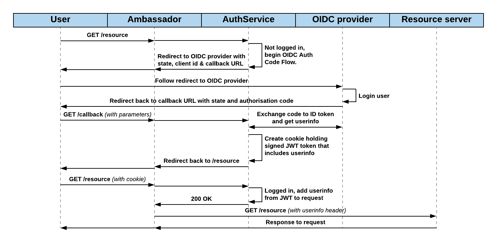

# OpenID Connect for Ambassador API Gateway

Ambassador-Auth-OIDC offers OpenID Connect support as [Ambassador API Gateway](https://www.getambassador.io/)'s [AuthService manifest](https://www.getambassador.io/reference/services/auth-service).

## OpenID Connect

[OpenID Connect (OIDC)](http://openid.net/connect/) is an authentication layer on top of the OAuth 2.0 protocol. As OAuth 2.0 is fully supported by OpenID Connect, existing OAuth 2.0 implementations work with it out of the box.

Currently it only supports OIDC's [Authorization Code Flow](http://openid.net/specs/openid-connect-basic-1_0.html#CodeFlow), similar to OAuth 2.0 Authorization Code Grant. No immediate plan exists to support implicit or hybrid flows, but pull requests are more than welcome!

## Example auth flow



## Options

Following environment variables are used by the software.

**Compulsary**
+ **OIDC_PROVIDER** URL to your OIDC provider, for example: https://you.eu.auth0.com/
+ **SELF_URL** URL of your application and same as your Ambassador root URL, for example: https://app.yourapp.com 
+ **OIDC_SCOPES** OIDC scopes wanted for userinfo, for example: "profile email"
+ **CLIENT_ID** Client id for your application (given by your OIDC provider)
+ **CLIENT_SECRET** Client secret for your application
+ **REDIS_ADDRESS** Address for your Redis instance, IP or hostname
+ **REDIS_PASSWORD** Password for your Redis instance

**Optional**
+ **PORT** Port to listen for requests. Default is 8080.
+ **JWT_HMAC_SECRET** HMAC secret key for creating JSON Web Tokens. Must be at least 64 characters long. If smaller or not existing, a random one will be created.
+ **LOGOUT_COOKIE** Set to 'true' if you want to wipe the old cookie when logging out. This causes the browser to re-login next time your application is visited. Default is not enabled.
+ **SKIP_AUTH_URI** Space separated list of URIs like "/info /health" to bypass auth. Default ""

## Usage

All (except the Kubernetes one) expect that you've cloned the code into your own Go environment (for example, to $GOPATH/src/github.com/ajmyyra/ambassador-auth-oidc).

On browser-side, AuthProxy sets up a cookie named "auth" when redirecting the browser back to the original resource. After login, requests are allowed through by either with a cookie or by setting `X-Auth-Token` header in the request. Token is a JSON Web Token that can be fetched from the "auth" cookie through `document.cookie` in DOM.

### As binary
Start by cloning the code into your own Go environment (for example, to $GOPATH/src/github.com/ajmyyra/ambassador-auth-oidc). Fetch dependencies, build the binary and run it.

```
cd /path/to/code
go get github.com/golang/dep/cmd/dep
$GOPATH/bin/dep ensure
go build
./ambassador-auth-oidc
```

### In Docker

Start the container with `docker run`.

```
docker run -p 8080:8080 -e OIDC_PROVIDER="https://your-oidc-provider/" -e SELF_URL="http://your-server.com:8080" -e OIDC_SCOPES="profile email" -e CLIENT_ID="YOUR_CLIENT_ID" -e CLIENT_SECRET="YOUR_CLIENT_SECRET" -e REDIS_ADDRESS="redis:6379" -e REDIS_PASSWORD="YOUR_REDIS_PASSWORD" ajmyyra/ambassador-auth-oidc:1.2
```

### With Ambassador in Kubernetes

If you haven't already, start Ambassador using the [official instructions](https://www.getambassador.io/user-guide/getting-started).

After Ambassador is up and running, create secrets and start ExtAuth component with following podspec.

```
kubectl create secret generic ambassador-auth-jwt-key --from-literal=jwt-key=$(openssl rand -base64 64|tr -d '\n ')
kubectl create secret generic ambassador-auth-redis-password --from-literal=redis-password=$(openssl rand -base64 20)
kubectl create secret generic ambassador-auth-oidc-provider --from-literal=oidc-provider=YOUR_OIDC_PROVIDER_URL
kubectl create secret generic ambassador-auth-self-url --from-literal=self-url=YOUR_SELF_URL
kubectl create secret generic ambassador-auth-client-id --from-literal=client-id=YOUR_OIDC_CLIENT_ID
kubectl create secret generic ambassador-auth-client-secret --from-literal=client-secret=YOUR_OIDC_CLIENT_SECRET
kubectl get secrets # To confirm they've been created
kubectl create -f auth-deployment.yaml
kubectl create -f auth-service.yaml
```

An example specs of [auth-deployment](misc/auth-deployment.yaml.example) and [auth-service](misc/auth-service.yaml.example) can be found from the misc folder.
